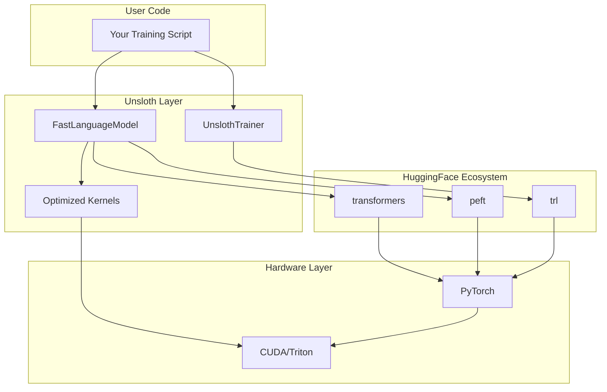
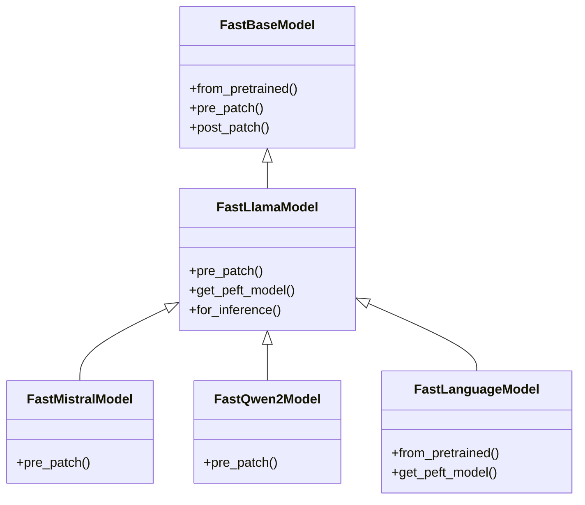

# Blog 1: Understanding Unsloth: Architecture and Core Concepts

**Reading Time:** 12 minutes
**Commit:** `341ce85864d191e4a6b7c447b9167c1faf5e20d3`

---

## What You'll Learn

- The problem Unsloth solves and why it matters
- High-level architecture and design philosophy
- Key design decisions and their trade-offs
- Core abstractions and how they interact

---

## Introduction

Fine-tuning Large Language Models is computationally expensive. A single training run on a 7B parameter model can take hours on an A100 GPU and cost hundreds of dollars in cloud compute. For many developers, this puts LLM customization out of reach.

Unsloth changes this equation. By providing a drop-in replacement for HuggingFace's training stack that delivers 2-5x faster training with 30-50% less memory, Unsloth makes fine-tuning accessible on consumer hardware.

But how does it achieve these gains? Let's explore Unsloth's architecture to understand the engineering decisions that make this possible.

---

## The Problem Domain

Before diving into code, let's understand what makes LLM fine-tuning computationally challenging:

1. **Memory constraints:** A 7B model needs ~14GB just for weights in FP16, plus activations during training
2. **Compute intensity:** Each training step involves billions of floating-point operations
3. **I/O overhead:** Loading models, checkpointing, and data loading all add latency
4. **Library overhead:** HuggingFace's transformers prioritizes flexibility over performance

Unsloth targets all four areas, but focuses primarily on compute and memory optimization through custom CUDA kernels.

---

## Architecture Overview

Unsloth uses what we can call a **Layered Decorator Architecture** - it wraps the HuggingFace ecosystem with optimized implementations while maintaining API compatibility.



### Layer Responsibilities

| Layer | Purpose | Key Components |
|-------|---------|----------------|
| **User Interface** | Provide simple, familiar API | FastLanguageModel, UnslothTrainer |
| **Optimization** | Apply performance improvements | Monkey-patches, memory management |
| **Integration** | Bridge to HuggingFace | PEFT integration, TRL compatibility |
| **Kernel** | Execute optimized GPU code | Triton kernels, Flash Attention |

---

## The Core Abstraction: FastLanguageModel

The `FastLanguageModel` class ([`unsloth/models/loader.py`](https://github.com/unslothai/unsloth/blob/341ce85864d191e4a6b7c447b9167c1faf5e20d3/unsloth/models/loader.py)) is your primary entry point to Unsloth:

```python
from unsloth import FastLanguageModel

# Load an optimized model
model, tokenizer = FastLanguageModel.from_pretrained(
    model_name="unsloth/llama-3-8b-bnb-4bit",
    max_seq_length=2048,
    load_in_4bit=True,
)

# Apply LoRA
model = FastLanguageModel.get_peft_model(
    model,
    r=16,
    lora_alpha=16,
    target_modules=["q_proj", "v_proj", "k_proj", "o_proj"],
)
```

This simple interface hides considerable complexity. Under the hood, `from_pretrained` performs several operations:

1. **Model Resolution:** Maps the model name to its architecture using the registry
2. **Loading:** Loads the base model with appropriate quantization
3. **Patching:** Replaces HuggingFace components with optimized versions
4. **Configuration:** Sets up memory management and attention optimizations

### Why This Design?

> **Design Decision:** Unsloth uses a familiar API (`from_pretrained`) rather than inventing new patterns.

This is intentional. By mimicking HuggingFace's interface, Unsloth achieves two goals:

1. **Low barrier to entry:** Existing code needs minimal changes
2. **Ecosystem compatibility:** Works with existing tools, tutorials, and workflows

The trade-off is that Unsloth must maintain compatibility with HuggingFace's rapidly evolving API, which requires constant updates.

---

## The Monkey-Patching Strategy

Unsloth's most distinctive architectural choice is using **monkey-patching** to inject optimizations. Rather than forking transformers or requiring users to modify their code, Unsloth replaces methods at runtime.

Here's a simplified example from [`unsloth/models/llama.py`](https://github.com/unslothai/unsloth/blob/341ce85864d191e4a6b7c447b9167c1faf5e20d3/unsloth/models/llama.py):

```python
# Original HuggingFace method is replaced with optimized version
LlamaAttention.forward = LlamaAttention_fast_forward
LlamaDecoderLayer.forward = LlamaDecoderLayer_fast_forward
LlamaModel.forward = LlamaModel_fast_forward
```

### Patches Applied

Unsloth patches ~100 methods across the HuggingFace stack:

| Component | What's Patched | Benefit |
|-----------|---------------|---------|
| Attention | Forward pass with Flash Attention | 5-25x speedup |
| Layer Norm | RMS norm with Triton kernel | 1.2-1.5x speedup |
| LoRA | Backward pass with fused kernel | 5-10x speedup |
| Cross-entropy | Loss computation | 20-30% speedup |
| Embedding | Gradient computation | Memory reduction |

### Trade-offs of Monkey-Patching

**Advantages:**
- No fork to maintain
- Users don't change their code
- Works with existing HuggingFace ecosystem
- Can selectively apply optimizations

**Disadvantages:**
- Fragile to HuggingFace updates
- Debugging can be confusing (stack traces show patched methods)
- Must track internal HuggingFace implementation details
- Version pinning required (see excluded versions in `pyproject.toml`)

---

## Model Architecture Support

Unsloth supports 100+ model variants through a hierarchy of model classes:



### Why Inherit from FastLlamaModel?

Most modern LLMs (Mistral, Qwen, Gemma) share Llama's architecture with minor variations. By making `FastLlamaModel` the base class, Unsloth maximizes code reuse - only architecture-specific differences need overriding.

This approach has a naming quirk (Mistral inherits from "Llama") but significantly reduces duplication.

---

## The Model Registry

The registry system ([`unsloth/registry/`](https://github.com/unslothai/unsloth/blob/341ce85864d191e4a6b7c447b9167c1faf5e20d3/unsloth/registry/)) maps model identifiers to metadata:

```python
# From unsloth/registry/_llama.py
MODEL_REGISTRY["unsloth/llama-3-8b-bnb-4bit"] = ModelInfo(
    model_type="llama",
    architecture=FastLlamaModel,
    quantization=QuantType.BNB_4BIT,
    max_seq_length=8192,
)
```

When you call `FastLanguageModel.from_pretrained("unsloth/llama-3-8b-bnb-4bit")`:

1. Registry lookup finds the `ModelInfo`
2. Appropriate `Fast*Model` class is selected
3. Model is loaded with correct quantization settings
4. Architecture-specific patches are applied

This design makes adding new models straightforward - just add a registry entry and (if needed) a new model class.

---

## Memory Management Philosophy

Unsloth takes an aggressive approach to VRAM optimization. The philosophy is: **use every trick available to fit larger models on smaller GPUs.**

Key techniques:

### 1. Selective Gradient Checkpointing
Standard gradient checkpointing recomputes all activations during backward pass. Unsloth's "smart" checkpointing selectively applies this based on memory pressure ([`unsloth/models/_utils.py`](https://github.com/unslothai/unsloth/blob/341ce85864d191e4a6b7c447b9167c1faf5e20d3/unsloth/models/_utils.py)):

```python
# Simplified from patch_unsloth_smart_gradient_checkpointing
def should_checkpoint(layer_idx, total_layers, memory_threshold):
    # Checkpoint every Nth layer based on available memory
    return layer_idx % checkpoint_every == 0
```

### 2. Global Buffer Reuse
Instead of allocating new buffers for each operation, Unsloth maintains global buffers that are reused ([`unsloth/kernels/utils.py`](https://github.com/unslothai/unsloth/blob/341ce85864d191e4a6b7c447b9167c1faf5e20d3/unsloth/kernels/utils.py)):

```python
# Global buffers for dequantization
DEQUANTIZE_BUFFER = None

def get_dequantize_buffer(shape, dtype, device):
    global DEQUANTIZE_BUFFER
    if DEQUANTIZE_BUFFER is None or DEQUANTIZE_BUFFER.shape != shape:
        DEQUANTIZE_BUFFER = torch.empty(shape, dtype=dtype, device=device)
    return DEQUANTIZE_BUFFER
```

### 3. KV Cache Chunking
Rather than allocating the full KV cache upfront, Unsloth allocates in 512-token chunks as needed ([`unsloth/models/llama.py:133`](https://github.com/unslothai/unsloth/blob/341ce85864d191e4a6b7c447b9167c1faf5e20d3/unsloth/models/llama.py#L133)):

```python
# Allocate KV cache incrementally
if past_key_values is None:
    past_key_values = DynamicCache()
```

---

## Training Integration: UnslothTrainer

The `UnslothTrainer` ([`unsloth/trainer.py`](https://github.com/unslothai/unsloth/blob/341ce85864d191e4a6b7c447b9167c1faf5e20d3/unsloth/trainer.py)) extends TRL's `SFTTrainer` with additional optimizations:

```python
from unsloth import UnslothTrainer, UnslothTrainingArguments

trainer = UnslothTrainer(
    model=model,
    train_dataset=dataset,
    args=UnslothTrainingArguments(
        per_device_train_batch_size=2,
        gradient_accumulation_steps=4,
        learning_rate=2e-4,
        embedding_learning_rate=2e-5,  # Unsloth-specific
    ),
)
```

### Key Enhancement: Embedding Learning Rate

Embeddings often benefit from different learning rates than other parameters. `UnslothTrainingArguments` adds `embedding_learning_rate` to configure this separately:

```python
# From trainer.py - simplified
def create_optimizer(self):
    param_groups = [
        {"params": embedding_params, "lr": self.args.embedding_learning_rate},
        {"params": other_params, "lr": self.args.learning_rate},
    ]
    return torch.optim.AdamW(param_groups)
```

---

## Configuration and Environment

Unsloth uses environment variables for configuration that can't be in code:

| Variable | Purpose |
|----------|---------|
| `UNSLOTH_ENABLE_LOGGING` | Enable verbose logging |
| `UNSLOTH_DISABLE_COMPILING` | Disable torch.compile |

Runtime configuration happens through function parameters, keeping the API clean while allowing customization.

---

## Key Design Decisions Summary

| Decision | Rationale | Trade-off |
|----------|-----------|-----------|
| Monkey-patching | No fork needed, API compatibility | Fragile to updates |
| Single base class (FastLlamaModel) | Code reuse | Confusing naming |
| Zero mandatory deps | User controls PyTorch version | Complex installation |
| Global buffers | Memory efficiency | Thread safety concerns |
| Version exclusions | Avoid known bugs | Limits compatibility |

---

## Key Takeaways

1. **Unsloth is a decorator layer** that wraps HuggingFace with optimizations while maintaining API compatibility

2. **Monkey-patching enables drop-in replacement** but creates fragility to upstream changes

3. **Memory optimization is aggressive** using gradient checkpointing, buffer reuse, and incremental allocation

4. **The registry system** cleanly separates model metadata from implementation

5. **Trade-offs favor performance** over maintainability and generality

---

## What's Next

In [Blog 2: Deep Dive into FastLanguageModel](./02-deep-dive-fastlanguagemodel.md), we'll trace through exactly what happens when you load a model, examining the patching process and optimization pipeline in detail.

---

*Continue to [Blog 2: Deep Dive into FastLanguageModel](./02-deep-dive-fastlanguagemodel.md)*
