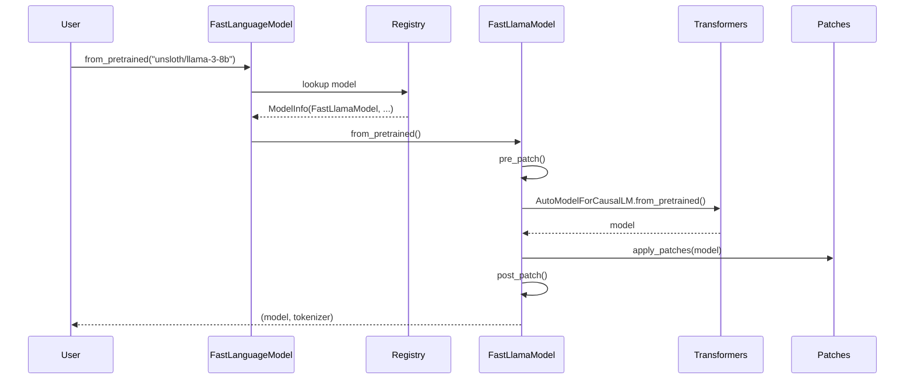

# Blog 2: Deep Dive: The FastLanguageModel Optimization Pipeline

**Reading Time:** 15 minutes
**Commit:** `341ce85864d191e4a6b7c447b9167c1faf5e20d3`

---

## What You'll Learn

- The complete loading and patching pipeline
- How monkey-patching works in practice
- LoRA optimization implementation details
- Memory management techniques with code examples

---

## Introduction

In the previous post, we explored Unsloth's high-level architecture. Now let's trace through exactly what happens when you load a model with `FastLanguageModel.from_pretrained()`.

Understanding this pipeline will help you debug issues, extend Unsloth for new models, and appreciate the engineering that delivers those impressive speedups.

---

## The Loading Pipeline

When you call `FastLanguageModel.from_pretrained()`, here's the sequence of operations:



Let's examine each step in detail.

---

## Step 1: Model Resolution

The first task is mapping the model name to its implementation. This happens in [`unsloth/models/loader.py`](https://github.com/unslothai/unsloth/blob/341ce85864d191e4a6b7c447b9167c1faf5e20d3/unsloth/models/loader.py):

```python
# Simplified from FastLanguageModel.from_pretrained
@staticmethod
def from_pretrained(
    model_name,
    max_seq_length=None,
    dtype=None,
    load_in_4bit=True,
    **kwargs,
):
    # Step 1: Resolve model info from registry
    model_info = get_model_info(model_name)

    # Step 2: Get the appropriate Fast*Model class
    model_class = model_info.architecture  # e.g., FastLlamaModel

    # Step 3: Delegate to that class
    return model_class.from_pretrained(
        model_name=model_name,
        max_seq_length=max_seq_length,
        dtype=dtype,
        load_in_4bit=load_in_4bit,
        **kwargs,
    )
```

The registry lookup ([`unsloth/registry/__init__.py`](https://github.com/unslothai/unsloth/blob/341ce85864d191e4a6b7c447b9167c1faf5e20d3/unsloth/registry/__init__.py)) first checks exact matches, then tries to infer the model type from configuration files:

```python
def get_model_info(model_name):
    # Try exact match
    if model_name in MODEL_REGISTRY:
        return MODEL_REGISTRY[model_name]

    # Try to infer from config
    config = AutoConfig.from_pretrained(model_name)
    model_type = config.model_type  # e.g., "llama", "mistral"

    # Map model_type to Fast*Model class
    return infer_model_info(model_type, config)
```

---

## Step 2: Pre-Patching

Before loading the model from HuggingFace, Unsloth patches the transformers library itself. This is the `pre_patch()` phase in [`unsloth/models/llama.py`](https://github.com/unslothai/unsloth/blob/341ce85864d191e4a6b7c447b9167c1faf5e20d3/unsloth/models/llama.py):

```python
@staticmethod
def pre_patch():
    # Patch transformers classes BEFORE loading
    import transformers.models.llama.modeling_llama as modeling_llama

    # Replace attention forward
    modeling_llama.LlamaAttention.forward = LlamaAttention_fast_forward

    # Replace decoder layer forward
    modeling_llama.LlamaDecoderLayer.forward = LlamaDecoderLayer_fast_forward

    # Replace model forward
    modeling_llama.LlamaModel.forward = LlamaModel_fast_forward

    # Patch RMS norm with Triton kernel
    modeling_llama.LlamaRMSNorm.forward = fast_rms_layernorm_forward
```

### Why Pre-Patch?

> **Design Decision:** Patching before loading ensures all model instances use optimized code.

If we patched after loading, the model instance would have references to the original methods. By patching the class definitions first, all subsequently created instances automatically use the optimized versions.

---

## Step 3: Model Loading

With patches in place, Unsloth loads the model using HuggingFace's standard mechanism:

```python
# From FastLlamaModel.from_pretrained - simplified
model = AutoModelForCausalLM.from_pretrained(
    model_name,
    torch_dtype=dtype,
    quantization_config=bnb_config if load_in_4bit else None,
    device_map="auto",
    **kwargs,
)
```

For 4-bit quantization, Unsloth configures bitsandbytes:

```python
from transformers import BitsAndBytesConfig

bnb_config = BitsAndBytesConfig(
    load_in_4bit=True,
    bnb_4bit_compute_dtype=torch.bfloat16,
    bnb_4bit_use_double_quant=True,  # Nested quantization
    bnb_4bit_quant_type="nf4",       # Normalized float 4-bit
)
```

---

## Step 4: Post-Patching

After loading, additional optimizations are applied that require the model instance:

```python
@staticmethod
def post_patch(model, tokenizer, **kwargs):
    # Configure gradient checkpointing
    patch_unsloth_smart_gradient_checkpointing(model)

    # Patch tokenizer for better performance
    patch_tokenizer(tokenizer)

    # Set up KV cache optimization
    model._supports_cache_class = True

    # Configure for memory efficiency
    model.config.use_cache = False  # Disable during training

    return model, tokenizer
```

### Gradient Checkpointing Patch

The smart gradient checkpointing ([`unsloth/models/_utils.py`](https://github.com/unslothai/unsloth/blob/341ce85864d191e4a6b7c447b9167c1faf5e20d3/unsloth/models/_utils.py)) is one of Unsloth's key memory optimizations:

```python
def patch_unsloth_smart_gradient_checkpointing(model):
    """
    Apply selective gradient checkpointing based on memory pressure.
    Standard checkpointing saves ALL activations; we checkpoint selectively.
    """
    # Count layers
    num_layers = len(model.model.layers)

    # Determine checkpoint frequency based on memory
    # More VRAM = checkpoint less frequently
    vram_gb = torch.cuda.get_device_properties(0).total_memory / 1e9

    if vram_gb < 8:
        checkpoint_every = 1  # Every layer
    elif vram_gb < 16:
        checkpoint_every = 2  # Every other layer
    else:
        checkpoint_every = 4  # Every 4th layer

    # Apply to specific layers
    for i, layer in enumerate(model.model.layers):
        if i % checkpoint_every == 0:
            layer.gradient_checkpointing = True
        else:
            layer.gradient_checkpointing = False
```

---

## The Optimized Forward Pass

Let's examine what an optimized forward pass looks like. Here's the attention optimization from [`unsloth/models/llama.py`](https://github.com/unslothai/unsloth/blob/341ce85864d191e4a6b7c447b9167c1faf5e20d3/unsloth/models/llama.py):

```python
def LlamaAttention_fast_forward(
    self,
    hidden_states,
    attention_mask=None,
    position_ids=None,
    past_key_value=None,
    output_attentions=False,
    use_cache=False,
    **kwargs,
):
    bsz, q_len, _ = hidden_states.size()

    # 1. Optimized Q/K/V projection
    # Instead of separate projections, use fused operation
    query_states = self.q_proj(hidden_states)
    key_states = self.k_proj(hidden_states)
    value_states = self.v_proj(hidden_states)

    # 2. Apply RoPE with optimized Triton kernel
    query_states, key_states = apply_rotary_pos_emb_fast(
        query_states, key_states, position_ids
    )

    # 3. Use Flash Attention instead of standard attention
    if HAS_FLASH_ATTN:
        attn_output = flash_attn_func(
            query_states,
            key_states,
            value_states,
            causal=True,
        )
    else:
        # Fallback to standard attention
        attn_output = standard_attention(
            query_states, key_states, value_states,
            attention_mask
        )

    # 4. Output projection
    attn_output = self.o_proj(attn_output)

    return attn_output, None, past_key_value
```

### Key Optimizations

1. **Flash Attention:** Reduces memory from O(n²) to O(n) and speeds up computation
2. **Triton RoPE:** Custom kernel for rotary embeddings
3. **Fused operations:** Combine multiple operations into single kernel launches

---

## LoRA Optimization: The Fast Backward Pass

One of Unsloth's most impactful optimizations is the LoRA backward pass. Standard LoRA requires computing gradients through the full A and B matrices separately. Unsloth fuses these into a single operation.

From [`unsloth/kernels/fast_lora.py`](https://github.com/unslothai/unsloth/blob/341ce85864d191e4a6b7c447b9167c1faf5e20d3/unsloth/kernels/fast_lora.py):

```python
class LoRA_MLP(torch.autograd.Function):
    """
    Fused LoRA implementation for MLP layers.
    Computes forward and backward in optimized kernels.
    """

    @staticmethod
    def forward(ctx, X, W, W_quant, A, B, scaling):
        """
        Forward: Y = X @ W + scaling * (X @ A @ B)
        """
        # Save for backward
        ctx.save_for_backward(X, W_quant, A, B)
        ctx.scaling = scaling

        # Base model computation
        Y = matmul_4bit(X, W, W_quant)  # 4-bit matmul

        # LoRA computation
        # X @ A @ B fused into single operation
        lora_output = triton_matmul_lora(X, A, B)
        Y = Y + scaling * lora_output

        return Y

    @staticmethod
    def backward(ctx, dY):
        """
        Backward: Compute gradients for A and B

        Standard LoRA backward:
            dA = X.T @ (dY @ B.T)
            dB = (X @ A).T @ dY

        Our fused approach computes both in single pass.
        """
        X, W_quant, A, B = ctx.saved_tensors
        scaling = ctx.scaling

        # Fused backward kernel
        dX, dA, dB = triton_lora_backward(
            dY, X, A, B, scaling
        )

        return dX, None, None, dA, dB, None
```

### Why This Matters

The fused backward pass provides a 5-10x speedup for LoRA training because:

1. **Reduced memory traffic:** Data loaded once, used for multiple computations
2. **Fewer kernel launches:** One fused kernel vs. multiple separate operations
3. **Better GPU utilization:** Larger kernels amortize launch overhead

---

## Memory Management in Detail

### Global Buffer Pattern

Unsloth maintains global buffers to avoid repeated allocations. From [`unsloth/kernels/utils.py`](https://github.com/unslothai/unsloth/blob/341ce85864d191e4a6b7c447b9167c1faf5e20d3/unsloth/kernels/utils.py):

```python
# Global buffers for dequantization operations
_DEQUANT_BUFFER = {}

def get_dequant_buffer(key, shape, dtype, device):
    """
    Get or create a buffer for dequantization.
    Reuses existing buffers when possible.
    """
    global _DEQUANT_BUFFER

    buffer_key = (key, shape, dtype, device)

    if buffer_key not in _DEQUANT_BUFFER:
        _DEQUANT_BUFFER[buffer_key] = torch.empty(
            shape, dtype=dtype, device=device
        )

    return _DEQUANT_BUFFER[buffer_key]
```

### The matmul_lora Function

This is the core of Unsloth's LoRA optimization ([`unsloth/kernels/utils.py:977`](https://github.com/unslothai/unsloth/blob/341ce85864d191e4a6b7c447b9167c1faf5e20d3/unsloth/kernels/utils.py#L977)):

```python
def matmul_lora(X, W, W_quant, A, B, scaling):
    """
    Compute: Y = X @ dequant(W) + scaling * X @ A @ B

    Optimizations:
    1. Dequantize W into reusable buffer
    2. Fuse LoRA computation
    3. Use Triton kernels for all matmuls
    """
    batch, seq_len, hidden = X.shape

    # Get dequantization buffer (reused across calls)
    W_dequant = get_dequant_buffer(
        "W", W.shape, X.dtype, X.device
    )

    # Dequantize weights (only when needed)
    fast_dequantize(W, W_quant, out=W_dequant)

    # Base computation
    Y = torch.matmul(X, W_dequant.T)

    # LoRA computation - fused
    # Instead of X @ A @ B, compute more efficiently:
    XA = torch.matmul(X.view(-1, hidden), A)  # [batch*seq, r]
    XAB = torch.matmul(XA, B)                  # [batch*seq, out]

    Y = Y + scaling * XAB.view(batch, seq_len, -1)

    return Y
```

---

## Tokenizer Optimization

Unsloth also optimizes tokenizers ([`unsloth/tokenizer_utils.py`](https://github.com/unslothai/unsloth/blob/341ce85864d191e4a6b7c447b9167c1faf5e20d3/unsloth/tokenizer_utils.py)):

```python
def patch_tokenizer(tokenizer):
    """
    Apply optimizations to tokenizer.
    """
    # 1. Set padding side for efficient batching
    tokenizer.padding_side = "right"

    # 2. Enable fast tokenization if available
    if hasattr(tokenizer, "is_fast") and not tokenizer.is_fast:
        # Try to get fast tokenizer
        try:
            from transformers import AutoTokenizer
            fast_tokenizer = AutoTokenizer.from_pretrained(
                tokenizer.name_or_path,
                use_fast=True
            )
            return fast_tokenizer
        except:
            pass

    # 3. Patch encode method for batching optimization
    original_encode = tokenizer.encode

    def fast_encode(text, **kwargs):
        # Use batch encoding even for single inputs
        return tokenizer.encode_plus(
            text,
            return_tensors="pt",
            **kwargs
        ).input_ids[0].tolist()

    tokenizer.encode = fast_encode

    return tokenizer
```

---

## Applying LoRA: get_peft_model

When you call `FastLanguageModel.get_peft_model()`, Unsloth wraps PEFT's standard LoRA application with optimizations:

```python
@staticmethod
def get_peft_model(
    model,
    r=16,
    lora_alpha=16,
    target_modules=["q_proj", "v_proj", "k_proj", "o_proj"],
    lora_dropout=0,
    bias="none",
    **kwargs,
):
    from peft import get_peft_model, LoraConfig

    # Create LoRA config
    lora_config = LoraConfig(
        r=r,
        lora_alpha=lora_alpha,
        target_modules=target_modules,
        lora_dropout=lora_dropout,
        bias=bias,
        task_type="CAUSAL_LM",
    )

    # Apply PEFT's LoRA
    model = get_peft_model(model, lora_config)

    # CRITICAL: Replace LoRA forward with Unsloth's fast version
    patch_lora_forward(model)

    return model


def patch_lora_forward(model):
    """
    Replace PEFT's LoRA forward with optimized version.
    """
    for name, module in model.named_modules():
        if isinstance(module, peft.tuners.lora.Linear):
            # Replace forward method
            module.forward = create_fast_lora_forward(module)
```

---

## Debugging the Pipeline

When things go wrong, understanding this pipeline helps debugging:

### Common Issues

1. **Model not found in registry:**
```python
# Error: Model "my-custom-model" not in registry
# Solution: Check model_type in config.json
```

2. **Patch not applied:**
```python
# Symptom: No speedup observed
# Check: Ensure unsloth is imported BEFORE transformers
import unsloth  # Must be first!
from transformers import ...
```

3. **Memory errors:**
```python
# Error: CUDA out of memory
# Solutions:
# - Reduce batch size
# - Enable gradient checkpointing
# - Use 4-bit quantization
```

### Verifying Patches

You can verify patches are applied:

```python
import unsloth
from transformers.models.llama.modeling_llama import LlamaAttention

# Check if forward is patched
print(LlamaAttention.forward.__name__)
# Should show "LlamaAttention_fast_forward"
```

---

## Performance Impact Summary

| Optimization | Component | Speedup | Memory |
|-------------|-----------|---------|--------|
| Flash Attention | Attention | 5-25x | -40% |
| Triton RMS Norm | LayerNorm | 1.2-1.5x | 0% |
| Fast LoRA | Backward | 5-10x | 0% |
| Buffer Reuse | All | 1.1x | -15% |
| Smart Checkpointing | Training | 0.9x | -50% |

---

## Key Takeaways

1. **Pre-patching is crucial:** Patches must apply before model loading for all instances to use optimized code

2. **Fused operations deliver major speedups:** The fast LoRA backward pass alone provides 5-10x improvement

3. **Memory management is aggressive:** Global buffers, selective checkpointing, and incremental allocation all contribute

4. **Each layer is optimized:** Attention, normalization, embeddings, and LoRA all have custom implementations

5. **The pipeline is intricate:** Understanding from_pretrained → pre_patch → load → post_patch → get_peft_model helps debugging

---

## What's Next

In [Blog 3: Patterns and Practices](./03-patterns-practices.md), we'll examine the design patterns Unsloth employs and how they contribute to maintainability (and where they fall short).

---

*Continue to [Blog 3: Patterns and Practices in Unsloth](./03-patterns-practices.md)*
