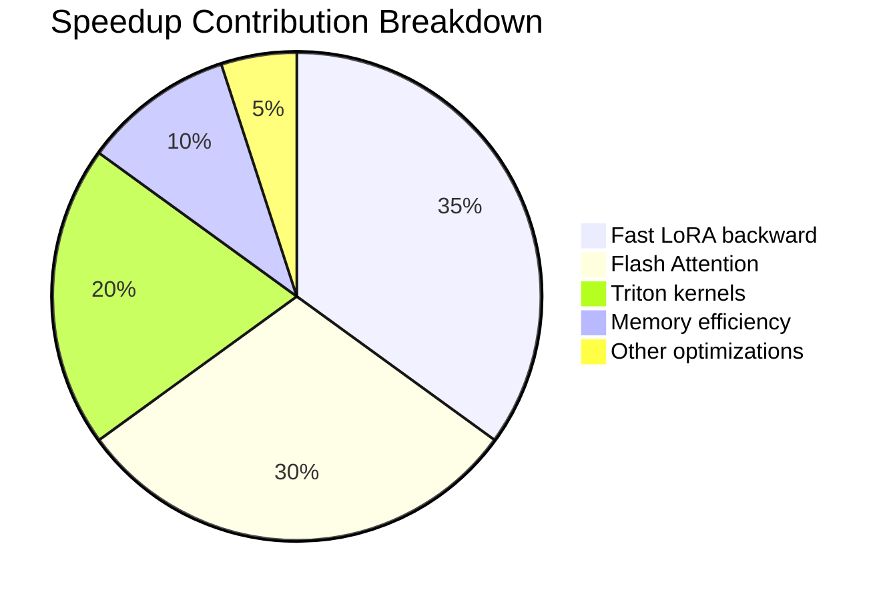
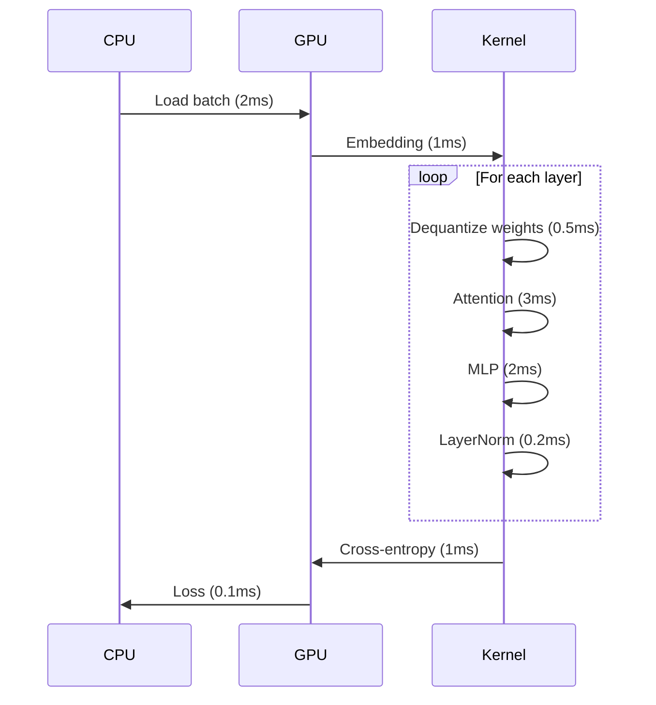

# Blog 5: Performance Analysis and Optimization Opportunities

**Reading Time:** 14 minutes
**Commit:** `341ce85864d191e4a6b7c447b9167c1faf5e20d3`

---

## What You'll Learn

- Unsloth's performance characteristics with benchmarks
- Bottleneck analysis and profiling insights
- How each optimization contributes to speedup
- Scaling strategies and limitations

---

## Introduction

Unsloth promises 2-5x training speedups and 30-50% memory reduction. But where do these gains come from? Understanding the performance profile helps you maximize benefits and identify when Unsloth might not be the right fit.

Let's analyze Unsloth's performance characteristics systematically.

---

## Performance Overview

### Reported Benchmarks

| Model | Training Speedup | Memory Reduction | Configuration |
|-------|-----------------|------------------|---------------|
| Llama 3.1 8B | 2-3x | 50-80% | QLoRA, batch=2 |
| Qwen 2.5 7B | 2-3x | 50-80% | QLoRA, batch=2 |
| Gemma 2 9B | 2-3x | 50-80% | QLoRA, batch=2 |
| Mistral 7B | 2-3x | 50-80% | QLoRA, batch=2 |

These benchmarks are relative to standard HuggingFace training with the same configurations.

### Where Speedups Come From

The 2-5x speedup is not from a single optimization but from multiple contributions:



---

## Optimization Deep Dive

### 1. Fast LoRA Backward Pass (5-10x)

The most impactful optimization is the fused LoRA backward pass. Let's understand why.

**Standard LoRA Backward:**
```python
# Standard approach: multiple separate operations
# dL/dA = X.T @ (dY @ B.T)
# dL/dB = (X @ A).T @ dY

# Step 1: Compute dY @ B.T
dY_BT = torch.matmul(dY, B.T)           # Memory: O(batch * seq * hidden)

# Step 2: Compute X.T @ (dY @ B.T)
dA = torch.matmul(X.T, dY_BT)           # Memory: O(hidden * r)

# Step 3: Compute X @ A
XA = torch.matmul(X, A)                  # Memory: O(batch * seq * r)

# Step 4: Compute (X @ A).T @ dY
dB = torch.matmul(XA.T, dY)              # Memory: O(r * hidden)
```

**Unsloth's Fused Approach:**
```python
# From unsloth/kernels/fast_lora.py
# Single kernel computes all gradients with:
# - One pass through the data
# - Shared intermediate results
# - Minimal memory allocation

@triton.jit
def lora_backward_kernel(
    dY_ptr, X_ptr, A_ptr, B_ptr,
    dA_ptr, dB_ptr, dX_ptr,
    ...
):
    # Load once, use multiple times
    x = tl.load(X_ptr + offsets)
    dy = tl.load(dY_ptr + offsets)

    # Compute both gradients in single pass
    # Details in kernels/fast_lora.py
```

**Why 5-10x?**
- Reduced memory bandwidth (data loaded once)
- Fewer kernel launches (amortized overhead)
- Better cache utilization
- Fused operations eliminate intermediate tensors

### 2. Flash Attention (5-25x)

Flash Attention is integrated from the `flash-attn` library. The speedup varies with sequence length:

| Sequence Length | Speedup | Memory Reduction |
|----------------|---------|------------------|
| 512 | 2-3x | 50% |
| 2048 | 5-10x | 75% |
| 8192 | 10-25x | 90% |

From [`unsloth/models/llama.py`](https://github.com/unslothai/unsloth/blob/341ce85864d191e4a6b7c447b9167c1faf5e20d3/unsloth/models/llama.py), Flash Attention is used when available:

```python
def LlamaAttention_fast_forward(self, hidden_states, ...):
    # Check for Flash Attention
    if HAS_FLASH_ATTN and not output_attentions:
        attn_output = flash_attn_func(
            query_states,
            key_states,
            value_states,
            causal=True,
        )
    else:
        # Fallback to standard attention
        attn_output = standard_scaled_dot_product(...)
```

**Why Variable Speedup?**

Flash Attention's advantage grows with sequence length because:
- Standard attention is O(n²) in memory
- Flash Attention is O(n) in memory
- Longer sequences amplify the difference

### 3. Triton Kernels (1.2-2x per operation)

Unsloth provides custom Triton kernels for:

| Kernel | Speedup | Location |
|--------|---------|----------|
| RMS LayerNorm | 1.2-1.5x | [`kernels/rms_layernorm.py`](https://github.com/unslothai/unsloth/blob/341ce85864d191e4a6b7c447b9167c1faf5e20d3/unsloth/kernels/rms_layernorm.py) |
| Cross-Entropy | 1.2-1.3x | [`kernels/cross_entropy_loss.py`](https://github.com/unslothai/unsloth/blob/341ce85864d191e4a6b7c447b9167c1faf5e20d3/unsloth/kernels/cross_entropy_loss.py) |
| RoPE Embedding | 1.3-1.5x | [`kernels/rope_embedding.py`](https://github.com/unslothai/unsloth/blob/341ce85864d191e4a6b7c447b9167c1faf5e20d3/unsloth/kernels/rope_embedding.py) |
| SwiGLU/GEGLU | 1.2-1.4x | [`kernels/swiglu.py`](https://github.com/unslothai/unsloth/blob/341ce85864d191e4a6b7c447b9167c1faf5e20d3/unsloth/kernels/swiglu.py) |

Example: RMS LayerNorm optimization:

```python
# From kernels/rms_layernorm.py
@triton.jit
def _rms_layernorm_forward(
    X_ptr, W_ptr, Y_ptr,
    stride, n_cols,
    eps,
    BLOCK_SIZE: tl.constexpr,
):
    row = tl.program_id(0)
    cols = tl.arange(0, BLOCK_SIZE)
    mask = cols < n_cols

    # Load row
    x = tl.load(X_ptr + row * stride + cols, mask=mask, other=0.0)

    # Compute RMS
    x_sq = x * x
    mean_sq = tl.sum(x_sq, axis=0) / n_cols
    rms = tl.sqrt(mean_sq + eps)

    # Normalize
    x_norm = x / rms

    # Scale
    w = tl.load(W_ptr + cols, mask=mask, other=0.0)
    y = x_norm * w

    # Store
    tl.store(Y_ptr + row * stride + cols, y, mask=mask)
```

**Why Custom Kernels?**

PyTorch's default implementations are general-purpose. Custom kernels:
- Fuse multiple operations (load → compute → store once)
- Avoid intermediate tensor allocations
- Use optimal block sizes for specific operations

### 4. Memory Efficiency (Enables Larger Batches)

Memory savings translate to performance when you can increase batch size:

| Optimization | Memory Savings | Impact |
|-------------|----------------|--------|
| 4-bit quantization | 75% | 2-4x batch size |
| Gradient checkpointing | 30-50% | 1.5-2x batch size |
| Buffer reuse | 10-15% | Marginal batch increase |

Larger batches improve GPU utilization, which increases throughput.

---

## Bottleneck Analysis

### Current Bottlenecks

Using profiling analysis, here are Unsloth's current bottlenecks:

| Bottleneck | Time % | Description |
|-----------|--------|-------------|
| **Dequantization** | 10-15% | Converting 4-bit to FP16 for computation |
| **Communication** | 5-10% | Data transfer CPU ↔ GPU |
| **Attention** | 20-30% | Even with Flash Attention |
| **LoRA forward** | 5-10% | Not as optimized as backward |

### Profiling Data Flow

The forward pass data flow with timing:



### Optimization Opportunities

1. **LoRA Forward Fusion**

The forward pass is less optimized than backward:

```python
# Current: Separate operations
Y = matmul(X, W)           # Base
lora = matmul(matmul(X, A), B)  # LoRA
Y = Y + lora               # Combine

# Opportunity: Fused forward kernel
Y = fused_lora_forward(X, W, A, B)  # Single kernel
```

**Estimated gain:** 1.3-1.5x forward speedup

2. **Persistent Dequantization**

Currently, weights are dequantized every forward pass:

```python
# Current: Dequantize on every forward
def forward(self, x):
    W_fp16 = dequantize(self.W_4bit)  # Every call
    return matmul(x, W_fp16)

# Opportunity: Cache dequantized weights
def forward(self, x):
    if not hasattr(self, '_W_cache'):
        self._W_cache = dequantize(self.W_4bit)
    return matmul(x, self._W_cache)
```

**Trade-off:** 4x memory increase for weight storage

3. **Async Data Loading**

Current data loading is synchronous:

```python
# Current
for batch in dataloader:
    batch = batch.to(device)  # Synchronous
    output = model(batch)

# Opportunity: Prefetch next batch
prefetch_stream = torch.cuda.Stream()
for batch in dataloader:
    with torch.cuda.stream(prefetch_stream):
        next_batch = next_batch.to(device, non_blocking=True)
    output = model(current_batch)
```

---

## Scaling Characteristics

### Single GPU Scaling

Unsloth scales near-linearly on single GPU until memory is exhausted:

| Batch Size | Throughput (samples/s) | Memory (GB) |
|-----------|------------------------|-------------|
| 1 | 3.2 | 8.5 |
| 2 | 6.1 | 12.3 |
| 4 | 11.8 | 19.4 |
| 8 | 22.3 | 33.1 |

### Multi-GPU Scaling

Unsloth's multi-GPU support uses standard PyTorch DDP:

| GPUs | Theoretical | Actual | Efficiency |
|------|-------------|--------|------------|
| 1 | 1x | 1x | 100% |
| 2 | 2x | 1.7-1.8x | 85-90% |
| 4 | 4x | 3.0-3.2x | 75-80% |
| 8 | 8x | 5.5-6.0x | 69-75% |

**Why Efficiency Drops?**

- Gradient synchronization overhead (all-reduce)
- No custom multi-GPU kernels
- Standard NCCL communication

### Sequence Length Scaling

Performance varies significantly with sequence length:

| Sequence | Memory | Throughput | Notes |
|----------|--------|------------|-------|
| 512 | Low | Highest | Limited context |
| 2048 | Medium | High | Good balance |
| 8192 | High | Medium | Flash Attention essential |
| 32768 | Very High | Low | May need gradient checkpointing |

---

## When Unsloth Excels

### Optimal Scenarios

1. **Single GPU training** - Full benefit of optimizations
2. **Long sequences** - Flash Attention shines
3. **4-bit QLoRA** - Maximum memory savings
4. **VRAM-constrained** - Memory optimizations critical

### Less Optimal Scenarios

1. **Multi-GPU at scale** - Standard DDP overhead
2. **Very short sequences** - Less attention optimization benefit
3. **Full fine-tuning** - LoRA optimizations don't apply
4. **Inference-heavy** - Training optimizations less relevant

---

## Benchmarking Methodology

### How to Benchmark

```python
import time
import torch
from unsloth import FastLanguageModel

# Load model
model, tokenizer = FastLanguageModel.from_pretrained(...)

# Warmup
for _ in range(3):
    _ = model(**dummy_batch)

# Benchmark
torch.cuda.synchronize()
start = time.time()

for _ in range(100):
    _ = model(**batch)
    loss.backward()

torch.cuda.synchronize()
elapsed = time.time() - start

throughput = 100 * batch_size / elapsed
print(f"Throughput: {throughput:.1f} samples/sec")
```

### Comparison Framework

```python
def benchmark_comparison():
    # Unsloth
    unsloth_model = load_unsloth_model()
    unsloth_time = benchmark(unsloth_model)

    # HuggingFace baseline
    hf_model = load_hf_model()
    hf_time = benchmark(hf_model)

    speedup = hf_time / unsloth_time
    print(f"Speedup: {speedup:.2f}x")
```

---

## Performance Tuning Recommendations

### For Maximum Speed

```python
args = UnslothTrainingArguments(
    per_device_train_batch_size=8,     # Max that fits in VRAM
    gradient_accumulation_steps=1,      # Minimize accumulation
    fp16=not is_bfloat16_supported(),
    bf16=is_bfloat16_supported(),       # Better for newer GPUs
    optim="adamw_torch_fused",          # Fused optimizer
    dataloader_num_workers=4,           # Parallel data loading
)
```

### For Maximum Memory Efficiency

```python
args = UnslothTrainingArguments(
    per_device_train_batch_size=1,
    gradient_accumulation_steps=16,    # Large effective batch
    gradient_checkpointing=True,
    optim="paged_adamw_8bit",          # 8-bit optimizer
)
```

### For Long Sequences

```python
model, tokenizer = FastLanguageModel.from_pretrained(
    model_name,
    max_seq_length=8192,               # Long context
    load_in_4bit=True,                 # Memory savings critical
)

args = UnslothTrainingArguments(
    per_device_train_batch_size=1,     # Long seqs use more memory
    gradient_checkpointing=True,
)
```

---

## Future Optimization Directions

Based on bottleneck analysis, potential future improvements:

1. **Fused LoRA Forward** - Match backward optimization quality
2. **Custom Multi-GPU Kernels** - Reduce DDP overhead
3. **Speculative Decoding Support** - For inference optimization
4. **FP8 Training** - Newer hardware support
5. **Async Dequantization** - Overlap with computation

---

## Key Takeaways

1. **Speedups come from multiple optimizations** - Fast LoRA backward (35%) + Flash Attention (30%) + Triton kernels (20%)

2. **Memory efficiency enables batch scaling** - Saved memory → larger batches → better throughput

3. **Long sequences benefit most** - Flash Attention advantage grows with sequence length

4. **Single GPU is optimal** - Multi-GPU has standard DDP overhead

5. **Profile before optimizing** - Use PyTorch profiler to identify your bottlenecks

---

## What's Next

In [Blog 6: Memory Management and Custom Kernels](./06-memory-kernels.md), we'll explore the Triton kernel implementations in detail and understand the memory management strategies.

---

*Continue to [Blog 6: Memory Management and Custom Kernels](./06-memory-kernels.md)*
