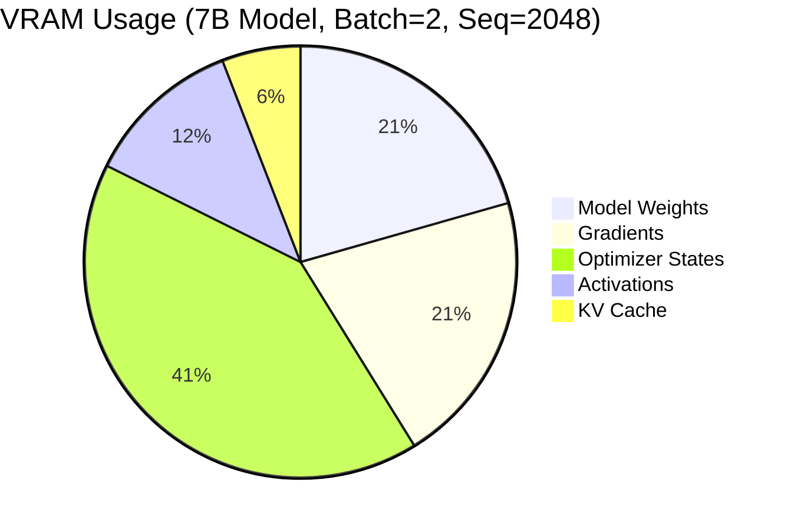

# Blog 6: Memory Management and Custom Kernels

**Reading Time:** 13 minutes
**Commit:** `341ce85864d191e4a6b7c447b9167c1faf5e20d3`

---

## What You'll Learn

- VRAM optimization techniques in detail
- Gradient checkpointing implementation
- Triton kernel anatomy and implementation patterns
- Buffer management strategies

---

## Introduction

GPU memory is the primary constraint for LLM training. A 7B parameter model needs ~14GB just for weights in FP16, and training requires additional memory for gradients, optimizer states, and activations.

Unsloth's memory optimizations are what make training large models on consumer GPUs possible. Let's understand how they work.

---

## Memory Breakdown

### Where Memory Goes

During training, VRAM is consumed by:



| Component | Standard (GB) | With Unsloth (GB) | Savings |
|-----------|--------------|-------------------|---------|
| Weights | 14 | 3.5 (4-bit) | 75% |
| Gradients | 14 | 0.5 (LoRA only) | 96% |
| Optimizer | 28 | 1.0 (LoRA params) | 96% |
| Activations | 8 | 4 (checkpointing) | 50% |
| **Total** | **64 GB** | **9 GB** | **86%** |

---

## 4-bit Quantization

### How It Works

4-bit quantization stores weights as 4-bit integers with quantization parameters:

```python
# Conceptual representation
class Quantized4BitLinear:
    def __init__(self, weight_fp16):
        # Quantize to 4-bit
        self.weight_4bit = quantize_nf4(weight_fp16)  # 4 bits per param
        self.quant_state = compute_quant_params(weight_fp16)  # Scale, zero-point

    def forward(self, x):
        # Dequantize for computation
        weight_fp16 = dequantize(self.weight_4bit, self.quant_state)
        return x @ weight_fp16.T
```

### NF4 (Normalized Float 4-bit)

Unsloth uses NF4 quantization from bitsandbytes, which is optimized for normally-distributed weights:

```python
# From bitsandbytes, used by Unsloth
bnb_config = BitsAndBytesConfig(
    load_in_4bit=True,
    bnb_4bit_quant_type="nf4",  # Normalized float 4-bit
    bnb_4bit_compute_dtype=torch.bfloat16,
    bnb_4bit_use_double_quant=True,  # Quantize the quantization constants
)
```

**Double Quantization:** Even the quantization parameters are quantized, saving additional memory.

### Dequantization Performance

Unsloth optimizes dequantization with buffer reuse ([`unsloth/kernels/utils.py`](https://github.com/unslothai/unsloth/blob/341ce85864d191e4a6b7c447b9167c1faf5e20d3/unsloth/kernels/utils.py)):

```python
# Global buffer to avoid repeated allocation
_DEQUANT_BUFFER = None

def fast_dequantize(weight_4bit, quant_state, out=None):
    global _DEQUANT_BUFFER

    # Reuse buffer if possible
    if out is None:
        shape = (weight_4bit.shape[0] * 2, weight_4bit.shape[1])
        if _DEQUANT_BUFFER is None or _DEQUANT_BUFFER.shape != shape:
            _DEQUANT_BUFFER = torch.empty(shape, dtype=torch.bfloat16, device=weight_4bit.device)
        out = _DEQUANT_BUFFER

    # Dequantize into buffer
    bnb.functional.dequantize_4bit(weight_4bit, quant_state, out=out)
    return out
```

---

## Gradient Checkpointing

### The Trade-off

Gradient checkpointing trades computation for memory:
- **Standard:** Store all activations, fast backward pass
- **Checkpointing:** Recompute activations during backward, slower but uses less memory

### Unsloth's Smart Checkpointing

Unsloth doesn't checkpoint all layers uniformly. It selectively checkpoints based on memory pressure ([`unsloth/models/_utils.py`](https://github.com/unslothai/unsloth/blob/341ce85864d191e4a6b7c447b9167c1faf5e20d3/unsloth/models/_utils.py)):

```python
def patch_unsloth_smart_gradient_checkpointing(model):
    """
    Apply selective gradient checkpointing.

    Strategy:
    - More VRAM available → checkpoint fewer layers
    - Less VRAM available → checkpoint more layers
    """
    # Get available VRAM
    vram_gb = torch.cuda.get_device_properties(0).total_memory / 1e9
    num_layers = len(model.model.layers)

    # Determine checkpoint frequency
    if vram_gb < 8:
        # Very limited VRAM: checkpoint every layer
        checkpoint_every = 1
    elif vram_gb < 16:
        # Limited VRAM: checkpoint every other layer
        checkpoint_every = 2
    elif vram_gb < 24:
        # Moderate VRAM: checkpoint every 4th layer
        checkpoint_every = 4
    else:
        # Ample VRAM: checkpoint every 8th layer
        checkpoint_every = 8

    # Apply to layers
    for i, layer in enumerate(model.model.layers):
        if i % checkpoint_every == 0:
            # This layer will recompute activations
            layer.gradient_checkpointing = True
        else:
            # This layer stores activations
            layer.gradient_checkpointing = False

    return model
```

### Memory Savings

| Strategy | Memory Usage | Compute Overhead |
|----------|-------------|------------------|
| No checkpointing | 100% | 0% |
| Checkpoint every 8th | 85% | 5% |
| Checkpoint every 4th | 70% | 10% |
| Checkpoint every 2nd | 55% | 20% |
| Checkpoint every layer | 40% | 33% |

---

## KV Cache Optimization

### The Problem

Standard KV cache allocation reserves memory for max sequence length upfront:

```python
# Standard: Pre-allocate full cache
kv_cache = torch.zeros(
    batch_size, num_heads, max_seq_length, head_dim
)  # May allocate 8GB+ unused memory
```

### Unsloth's Solution

Unsloth allocates KV cache incrementally ([`unsloth/models/llama.py`](https://github.com/unslothai/unsloth/blob/341ce85864d191e4a6b7c447b9167c1faf5e20d3/unsloth/models/llama.py)):

```python
class DynamicKVCache:
    """
    KV cache that grows in chunks.
    """
    def __init__(self, chunk_size=512):
        self.chunk_size = chunk_size
        self.cache = None
        self.current_length = 0

    def update(self, key_states, value_states, layer_idx):
        seq_length = key_states.shape[2]
        new_length = self.current_length + seq_length

        # Expand cache if needed
        if self.cache is None or new_length > self.cache.shape[2]:
            new_size = ((new_length // self.chunk_size) + 1) * self.chunk_size
            self._expand_cache(new_size)

        # Update cache
        self.cache[layer_idx, :, self.current_length:new_length] = key_states
        self.current_length = new_length

        return self.cache[layer_idx, :, :new_length]
```

**Benefit:** Memory only allocated as needed, saving 20-30% for sequences shorter than max.

---

## Triton Kernel Deep Dive

### Why Triton?

Triton is a language for writing GPU kernels that's more accessible than CUDA while maintaining performance:

- **Automatic optimization:** Triton handles tiling, shared memory, etc.
- **Python-like syntax:** Easier to write and maintain
- **Good performance:** Often 80-95% of hand-tuned CUDA

### Anatomy of a Triton Kernel

Let's examine the RMS LayerNorm kernel from [`unsloth/kernels/rms_layernorm.py`](https://github.com/unslothai/unsloth/blob/341ce85864d191e4a6b7c447b9167c1faf5e20d3/unsloth/kernels/rms_layernorm.py):

```python
import triton
import triton.language as tl

@triton.jit
def _rms_layernorm_forward_kernel(
    X_ptr,           # Input tensor pointer
    W_ptr,           # Weight tensor pointer
    Y_ptr,           # Output tensor pointer
    stride,          # Row stride
    n_cols,          # Number of columns
    eps,             # Epsilon for numerical stability
    BLOCK_SIZE: tl.constexpr,  # Compile-time constant
):
    """
    RMS LayerNorm: Y = X / sqrt(mean(X^2) + eps) * W

    Each program instance processes one row.
    """
    # Which row this program processes
    row_idx = tl.program_id(axis=0)

    # Compute column offsets for this row
    col_offsets = tl.arange(0, BLOCK_SIZE)
    mask = col_offsets < n_cols

    # Load input row
    X_row_ptr = X_ptr + row_idx * stride
    x = tl.load(X_row_ptr + col_offsets, mask=mask, other=0.0)

    # Compute mean of squares
    x_squared = x * x
    mean_squared = tl.sum(x_squared, axis=0) / n_cols

    # Compute RMS
    rms = tl.sqrt(mean_squared + eps)

    # Normalize
    x_normalized = x / rms

    # Load weights and apply
    w = tl.load(W_ptr + col_offsets, mask=mask, other=1.0)
    y = x_normalized * w

    # Store output
    Y_row_ptr = Y_ptr + row_idx * stride
    tl.store(Y_row_ptr + col_offsets, y, mask=mask)


def rms_layernorm_forward(x, weight, eps=1e-6):
    """
    Launch the RMS LayerNorm kernel.
    """
    # Output tensor
    y = torch.empty_like(x)

    # Get dimensions
    n_rows, n_cols = x.shape
    BLOCK_SIZE = triton.next_power_of_2(n_cols)

    # Launch kernel
    grid = (n_rows,)  # One program per row
    _rms_layernorm_forward_kernel[grid](
        x, weight, y,
        x.stride(0), n_cols, eps,
        BLOCK_SIZE=BLOCK_SIZE,
    )

    return y
```

### Key Concepts

1. **Program ID:** Each kernel instance processes one unit of work (one row)
2. **BLOCK_SIZE:** Number of elements processed per program
3. **Masking:** Handle dimensions not divisible by block size
4. **Pointer arithmetic:** Manual memory addressing

### Cross-Entropy Loss Kernel

A more complex example is the fused cross-entropy kernel from [`unsloth/kernels/cross_entropy_loss.py`](https://github.com/unslothai/unsloth/blob/341ce85864d191e4a6b7c447b9167c1faf5e20d3/unsloth/kernels/cross_entropy_loss.py):

```python
@triton.jit
def _cross_entropy_forward_kernel(
    logits_ptr, labels_ptr, loss_ptr,
    n_cols, ignore_index,
    BLOCK_SIZE: tl.constexpr,
):
    """
    Fused softmax + cross-entropy loss.

    Standard approach: 3 passes over data
    1. Find max for numerical stability
    2. Compute softmax
    3. Compute loss

    Fused approach: 2 passes
    1. Find max and sum for softmax
    2. Compute loss
    """
    row_idx = tl.program_id(0)

    # Load logits and label
    col_offsets = tl.arange(0, BLOCK_SIZE)
    mask = col_offsets < n_cols

    logits_ptr_row = logits_ptr + row_idx * n_cols
    logits = tl.load(logits_ptr_row + col_offsets, mask=mask, other=-float('inf'))

    label = tl.load(labels_ptr + row_idx)

    # Check for ignore_index
    if label == ignore_index:
        tl.store(loss_ptr + row_idx, 0.0)
        return

    # Find max for numerical stability
    max_logit = tl.max(logits, axis=0)

    # Compute log-sum-exp
    shifted_logits = logits - max_logit
    exp_logits = tl.exp(shifted_logits)
    sum_exp = tl.sum(exp_logits, axis=0)
    log_sum_exp = tl.log(sum_exp) + max_logit

    # Compute loss: -logits[label] + log_sum_exp
    label_logit = tl.load(logits_ptr_row + label)
    loss = -label_logit + log_sum_exp

    # Store
    tl.store(loss_ptr + row_idx, loss)
```

**Why Faster?**

- Single kernel vs. separate softmax + NLLLoss
- Data loaded once from global memory
- No intermediate tensor for softmax output

---

## Fast LoRA Implementation

The most impactful kernel is the LoRA backward pass. From [`unsloth/kernels/fast_lora.py`](https://github.com/unslothai/unsloth/blob/341ce85864d191e4a6b7c447b9167c1faf5e20d3/unsloth/kernels/fast_lora.py):

```python
class LoRA_MLP(torch.autograd.Function):
    """
    Optimized LoRA for MLP layers.

    Forward: Y = X @ W + scaling * X @ A @ B
    Backward: Compute dA, dB, dX efficiently
    """

    @staticmethod
    def forward(ctx, X, W, W_quant, A, B, scaling):
        # Save for backward
        ctx.save_for_backward(X, W_quant, A, B)
        ctx.scaling = scaling

        # Compute base
        Y = fast_matmul_4bit(X, W, W_quant)

        # Compute LoRA
        # Fuse X @ A @ B into efficient sequence
        XA = torch.matmul(X.view(-1, X.shape[-1]), A)
        XAB = torch.matmul(XA, B)

        Y = Y + scaling * XAB.view(X.shape[0], X.shape[1], -1)

        return Y

    @staticmethod
    def backward(ctx, dY):
        X, W_quant, A, B = ctx.saved_tensors
        scaling = ctx.scaling

        # Reshape for matmul
        X_flat = X.view(-1, X.shape[-1])
        dY_flat = dY.view(-1, dY.shape[-1])

        # Gradient for B: dB = (X @ A).T @ dY
        XA = torch.matmul(X_flat, A)
        dB = torch.matmul(XA.T, dY_flat) * scaling

        # Gradient for A: dA = X.T @ (dY @ B.T)
        dY_BT = torch.matmul(dY_flat, B.T)
        dA = torch.matmul(X_flat.T, dY_BT) * scaling

        # Gradient for X (if needed)
        # dX = dY @ W.T + scaling * dY @ B.T @ A.T
        # Usually not needed for LoRA training

        return None, None, None, dA, dB, None
```

### Why 5-10x Faster?

1. **No intermediate storage:** Standard autograd stores XA for backward; we recompute
2. **Fused scaling:** Scaling applied during gradient computation
3. **Optimized matmul order:** Minimize FLOPs for each gradient

---

## Buffer Management Patterns

### Global Buffer Pool

Unsloth maintains global buffers for frequently used temporary tensors:

```python
# From unsloth/kernels/utils.py
_BUFFER_POOL = {}

def get_buffer(name, shape, dtype, device):
    """
    Get or create a named buffer.
    """
    key = (name, shape, dtype, device)

    if key not in _BUFFER_POOL:
        _BUFFER_POOL[key] = torch.empty(shape, dtype=dtype, device=device)

    return _BUFFER_POOL[key]


def clear_buffers():
    """
    Clear all buffers to free memory.
    """
    global _BUFFER_POOL
    _BUFFER_POOL = {}
    torch.cuda.empty_cache()
```

### Usage Pattern

```python
def optimized_operation(x):
    # Get reusable buffer instead of allocating
    buffer = get_buffer("temp", x.shape, x.dtype, x.device)

    # Use buffer
    torch.matmul(x, weight, out=buffer)

    return buffer
```

### Memory Cleanup

Periodically clear unused memory:

```python
# From unsloth/models/_utils.py
def cleanup_memory():
    import gc
    gc.collect()
    torch.cuda.empty_cache()
    clear_buffers()
```

---

## Practical Memory Optimization

### Monitoring Memory

```python
def print_memory_usage():
    allocated = torch.cuda.memory_allocated() / 1e9
    reserved = torch.cuda.memory_reserved() / 1e9
    print(f"Allocated: {allocated:.2f} GB")
    print(f"Reserved: {reserved:.2f} GB")
```

### Finding Memory Leaks

```python
def find_large_tensors():
    import gc
    for obj in gc.get_objects():
        if torch.is_tensor(obj):
            if obj.device.type == 'cuda' and obj.numel() > 1e6:
                print(f"{obj.shape}: {obj.numel() * obj.element_size() / 1e6:.1f} MB")
```

### Optimization Checklist

- [ ] Use 4-bit quantization for base model
- [ ] Enable gradient checkpointing for long sequences
- [ ] Use paged optimizer (paged_adamw_8bit)
- [ ] Reduce batch size if OOM
- [ ] Clear cache periodically during training
- [ ] Use gradient accumulation for larger effective batch

---

## Key Takeaways

1. **4-bit quantization provides 75% memory savings** through NF4 quantization and double quantization

2. **Smart gradient checkpointing adapts to available VRAM** - more memory = less checkpointing

3. **KV cache grows incrementally** instead of pre-allocating for max sequence

4. **Triton kernels fuse operations** to minimize memory bandwidth and allocations

5. **Buffer reuse** avoids repeated allocations for temporary tensors

6. **LoRA optimization focuses on backward pass** where the biggest gains are possible

---

## Conclusion

This completes our deep dive into Unsloth's architecture and implementation. We've covered:

1. **Architecture** - Layered decorator pattern with monkey-patching
2. **Loading Pipeline** - Pre-patch, load, post-patch sequence
3. **Design Patterns** - Factory, Decorator, Strategy, Template Method
4. **Extension Points** - Adding models, training integration, export
5. **Performance** - Kernel optimizations and bottlenecks
6. **Memory** - Quantization, checkpointing, buffer management

Unsloth demonstrates that significant performance gains are possible through careful optimization at multiple levels - from kernel fusion to memory management. The trade-off is increased maintenance burden due to the monkey-patching approach, but for single-GPU training of large models, the benefits are substantial.

---

*Return to [Series Overview](./00-series-outline.md)*
