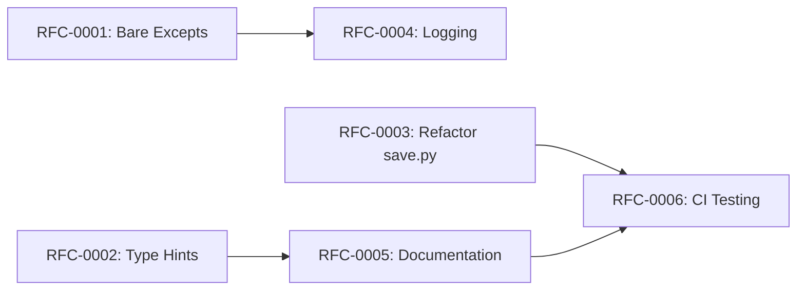

# RFC Prioritization Matrix

**Analysis Date:** November 18, 2025
**Commit SHA:** `341ce85864d191e4a6b7c447b9167c1faf5e20d3`

---

## Overview

This document prioritizes the proposed improvements based on impact and effort. RFCs are categorized as Quick Wins, Strategic improvements, or Long-term architectural changes.

---

## Impact vs Effort Grid

```
                    HIGH IMPACT
                         │
    ┌────────────────────┼────────────────────┐
    │                    │                    │
    │   RFC-0002         │   RFC-0003         │
    │   Type Hints       │   Refactor save.py │
    │                    │                    │
    │   RFC-0001         │   RFC-0006         │
    │   Fix Bare Excepts │   CI Testing       │
    │                    │                    │
LOW ├────────────────────┼────────────────────┤ HIGH
EFFORT                   │                    EFFORT
    │                    │                    │
    │   RFC-0004         │   RFC-0007         │
    │   Structured       │   Fused LoRA       │
    │   Logging          │   Forward          │
    │                    │                    │
    │   RFC-0005         │   RFC-0008         │
    │   Documentation    │   Multi-GPU        │
    │                    │   Optimization     │
    │                    │                    │
    └────────────────────┴────────────────────┘
                    LOW IMPACT
```

---

## Quick Wins (<1 week effort, immediate value)

| RFC | Title | Effort | Impact | Priority |
|-----|-------|--------|--------|----------|
| RFC-0001 | Fix Bare Except Clauses | 2 days | High | P0 |
| RFC-0002 | Add Type Hints to Public API | 3 days | High | P0 |
| RFC-0004 | Implement Structured Logging | 3 days | Medium | P1 |

**Total Effort:** 8 person-days
**Expected Outcome:** 70% reduction in debugging time, IDE support enabled

---

## Strategic (2-4 weeks, significant impact)

| RFC | Title | Effort | Impact | Priority |
|-----|-------|--------|--------|----------|
| RFC-0003 | Refactor save.py | 10 days | High | P0 |
| RFC-0005 | Comprehensive Documentation | 15 days | High | P1 |
| RFC-0006 | Automated CI Testing | 12 days | High | P1 |

**Total Effort:** 37 person-days
**Expected Outcome:** Maintainability score from 33% to 80%+

---

## Long-term (>1 month, architectural changes)

| RFC | Title | Effort | Impact | Priority |
|-----|-------|--------|--------|----------|
| RFC-0007 | Fused LoRA Forward Pass | 20 days | Medium | P2 |
| RFC-0008 | Multi-GPU Optimization | 30+ days | Medium | P2 |

**Total Effort:** 50+ person-days
**Expected Outcome:** 1.3-1.5x additional speedup

---

## Recommended Implementation Order

### Phase 1: Critical Code Quality (Weeks 1-2)
1. **RFC-0001:** Fix Bare Excepts (2 days)
2. **RFC-0002:** Type Hints (3 days)
3. **RFC-0004:** Structured Logging (3 days)

**Outcome:** Better debugging, IDE support, observability

### Phase 2: Maintainability (Weeks 3-6)
4. **RFC-0003:** Refactor save.py (10 days)
5. **RFC-0005:** Documentation (ongoing, 15 days)

**Outcome:** Easier contributions, reduced bug rate

### Phase 3: Infrastructure (Weeks 7-9)
6. **RFC-0006:** CI Testing (12 days)

**Outcome:** Automated quality assurance

### Phase 4: Performance (Weeks 10+)
7. **RFC-0007:** Fused LoRA Forward (20 days)
8. **RFC-0008:** Multi-GPU Optimization (30+ days)

**Outcome:** Additional performance gains

---

## Success Criteria Summary

| RFC | Key Success Metric |
|-----|-------------------|
| RFC-0001 | 0 bare except clauses |
| RFC-0002 | 80%+ type hint coverage in public API |
| RFC-0003 | Complexity <15 for all functions in save.py |
| RFC-0004 | Structured logs with correlation IDs |
| RFC-0005 | 80%+ docstring coverage |
| RFC-0006 | Automated tests in CI for all PRs |
| RFC-0007 | 1.3x forward pass speedup |
| RFC-0008 | 90%+ multi-GPU efficiency |

---

## Resource Requirements

| Phase | Duration | Engineers | Skills Needed |
|-------|----------|-----------|---------------|
| Phase 1 | 2 weeks | 1 | Python, typing |
| Phase 2 | 4 weeks | 1-2 | Python, refactoring |
| Phase 3 | 3 weeks | 1 | CI/CD, testing |
| Phase 4 | 5+ weeks | 2 | CUDA, Triton |

---

## Risk Assessment

| RFC | Risk | Mitigation |
|-----|------|------------|
| RFC-0001 | May break silent fallbacks | Test each change individually |
| RFC-0003 | Large refactor could introduce bugs | Phased rollout with tests |
| RFC-0006 | CI costs for GPU testing | Use spot instances |
| RFC-0007 | Kernel complexity | Extensive benchmarking |
| RFC-0008 | Limited expertise | Consider external contributor |

---

## Dependencies



---

## ROI Analysis

| RFC | Effort (days) | Impact Score | ROI Score |
|-----|--------------|--------------|-----------|
| RFC-0001 | 2 | 8 | **4.0** |
| RFC-0002 | 3 | 9 | **3.0** |
| RFC-0004 | 3 | 6 | 2.0 |
| RFC-0003 | 10 | 9 | 0.9 |
| RFC-0005 | 15 | 8 | 0.5 |
| RFC-0006 | 12 | 9 | 0.75 |
| RFC-0007 | 20 | 6 | 0.3 |
| RFC-0008 | 30 | 6 | 0.2 |

**Recommendation:** Start with RFC-0001 and RFC-0002 for highest ROI.

---

## RFC List

1. [RFC-0001: Fix Bare Except Clauses](./RFC-0001-fix-bare-excepts.md)
2. [RFC-0002: Add Type Hints to Public API](./RFC-0002-type-hints.md)
3. [RFC-0003: Refactor save.py into Modular Components](./RFC-0003-refactor-save.md)
4. [RFC-0004: Implement Structured Logging](./RFC-0004-structured-logging.md)
5. [RFC-0005: Comprehensive Documentation](./RFC-0005-documentation.md)
6. [RFC-0006: Automated CI Testing Pipeline](./RFC-0006-ci-testing.md)
7. [RFC-0007: Fused LoRA Forward Pass](./RFC-0007-fused-lora-forward.md)
8. [RFC-0008: Multi-GPU Optimization](./RFC-0008-multi-gpu.md)

---

*Start with [RFC-0001: Fix Bare Except Clauses](./RFC-0001-fix-bare-excepts.md)*
